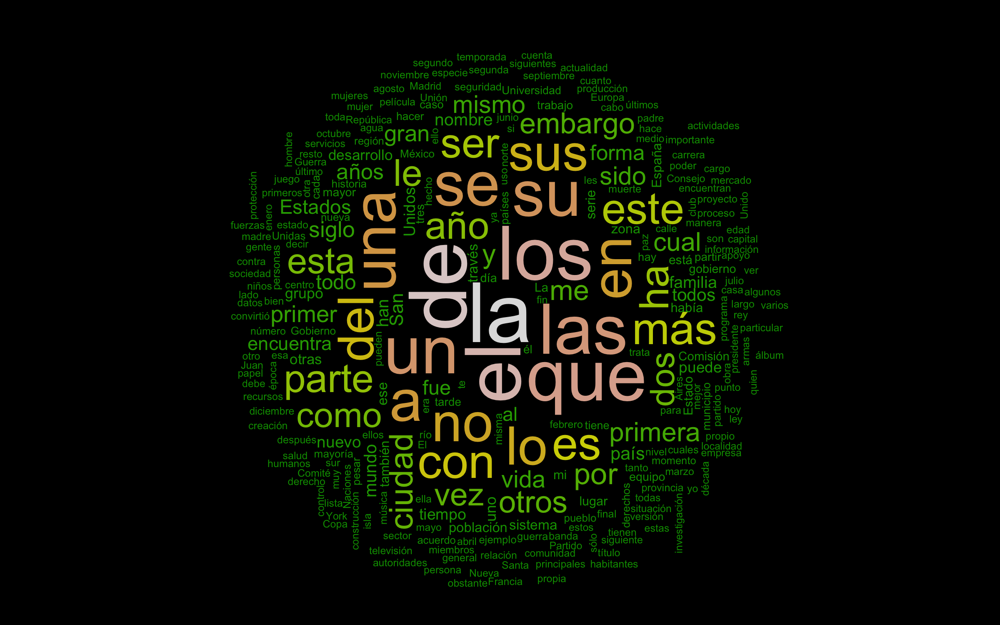

<a href="https://rvaz.shinyapps.io/es_predictor/" target="_blank">
<b>Presiona aquí</b></a> para ver la app online.

<a href="#eng_lang">**Click here**</a> to read the info in
<a href="#eng_lang">**English**</a>


## Procesamiento de Lenguaje Natural - Predictor de Palabras

### Contenido:

* Un archivo ejecutable de R con los algoritmos para predicciones de palabra actual y
palabra siguiente.  

* Los archivos requeridos por los algoritmos, con información sobre más de 1
millón de n-gramas y las palabras con la mayor probabilidad de proseguirlos.  

* Los archivos shinyUI y shinyServer para ejecutar la aplicación en Shiny.

### Instrucciones

* Para usar el programa en R, simplemente ejecuta [predict_both.R](predict_both.R) 
con todos los archivos .csv en el directorio. La función predict.both( ), con una
palabra o una frase como argumento, es la que genera las sugerencias para la
palabra en curso y la palabra siguiente.  

* Para ver el predictor en acción, visita la aplicación
<a href="https://rvaz.shinyapps.io/es_predictor/" target="_blank">aquí</a>.   

* Para más información visita la sección de información de la aplicación.    

* Para ver la versión inglés de la aplicación visita <a href="https://rvaz.shinyapps.io/english_predictor/" target="_blank">
English app</a>.  

* O para la versión bilingüe ingles-español con detector automático de idioma
visita <a href="https://rvaz.shinyapps.io/en_es_predictor/" target="_blank">
EN-ES app</a>.   

* Ver esta página en [GitHub Pages](https://reyvaz.github.io/NLP-Spanish-Predictor/).  

### Más Información

La aplicación admite texto en español y automáticamente genera,

1. Sugerencias para completar la palabra en curso.
2. Sugerencias para la palabra siguiente.

La creación de este programa empezó desde la recolección los siguientes textos,  

1. Spanish Billion  Words Corpus, recopilado por Cristian Cardellino (Marzo de 2016) y descargado en Septiembre 12 del 2017. La recopilación incluye:
porciones del SenSem, Corpus Ancora, Tibidabo Treebank y IULA Spanish LSP Treebank, Proyecto
OPUS, Europarl, Wikipedia, Wikisource y Wikibooks.
[Disponible aquí](http://crscardellino.me/SBWCE/).  

2. Artículos actualizados de Wikipedia versión español descargados  el 12 de septiembre
del 2017. [Disponible aquí](https://dumps.wikimedia.org/eswiki/20170901/eswiki-20170901pages-articles2.xml-p229079p1083449.bz2).  

3. Una colección de estados populares y recientes de Twitter en castellano. Descargados entre el 12 y el 14 de septiembre del 2017 usando el paquete `rtweet` de CRAN.   


Las fuentes fueron después procesadas en Python y R. El procesamiento del 
corpus se mantuvo intencionalmente al mínimo para así capturar el 
castellano tal y como es comúnmente escrito, incluyendo gramática,  errores ortográficos,
abreviaciones, siglas, jerga y regionalismos. 

De esta forma se le permitió al
programa creador del predictor, determinar la ortografía con la mayor probabilidad
de ser la correcta, sin rescindir de información sobre lo que el escritor intentaba decir. 
Gracias a esto, **el predictor es capaz de deducir con flexibilidad lo que el usuario
intenta decir, al tiempo que provee sugerencias con ortografía más rigurosa**.  
```r
predict.both("una sopa de")$predictions
```
```
[1] "fideos"   "guisantes" "ajo" "pescado" "tomate"     
```
```r
predict.both("una sopa de sanao")$current
```
```
[1] "zanahoria"   "zanahorias"     
```
El corpus final contiene ~200 millones de palabras en
un archivo no compreso de ~1.5 GiB. Cuenta con texto de diversas regiones de habla 
castellana pero mayormente de España, México, Argentina y Estados Unidos.

La codificación de palabras y eliminación de redundancias permiten al programa
almacenar información de más de 1 millón de n-gramas en 
menos de 25 MiB, resultando en una ejecución ligera y rápida. Al tiempo que se puede reducir la cantidad de n-gramas sin sacrificar precisión, al igual que se puede aumentar la información predictiva sin sacrificar recursos del sistema.
```r
workspace.size()
```
```
[1] "24.35 MiB"
```
Y generar sugerencias en pocos milisegundos en un sistema de computo 
modesto o personal.
```r
measure.prediction.time("El Presidente de")
```
```
[1] "la"   "los" "Estados" "México" "Venezuela"     
Milliseconds elapsed    = 2.0 
Predictions per second = 500 
```

<br><br>
<p align="center">
<a href="https://reyvaz.github.io/NLP-Spanish-Predictor/" 
rel="see html report">
</a>
</p>
<br><br>

<h1 id="eng_lang"></h1>
<br>

## Natural Language Processing - Spanish Word Predictor

[**Click here**](https://rvaz.shinyapps.io/english_predictor/) to visit the app

### Contents

* The R script with the word predicting algorithm which makes suggestions for 
the word being typed and for the next word.  

* The files required by the algorithm  with codified information of over 1 million ngrams.   

* The shinyUI and shinyServer scripts to run the predictor in a Shiny app.   

### Instructions

* To load and try the algorithm in R, source the 
[predict_both.R](predict_both.R) script with all the .csv files.
The function predict.both( ), with a word or phrase as an argument, is what will
produce the suggestions for both, the current word and the following word. 

* To see the predictor at work visit the app
<a href="https://rvaz.shinyapps.io/es_predictor/" target="_blank">
here</a>.   

* To learn more about the app, the algorithms, or the corpus, visit the 
information section of the shiny app.  

* For an English version of the predictor check the <a href="https://rvaz.shinyapps.io/english_predictor/" target="_blank">
English app</a>.  

* Or for a bilingual Spanish-English version with language auto-detect check the
<a href="https://rvaz.shinyapps.io/en_es_predictor/" target="_blank">
EN-ES app</a>.  

* [GitHub Pages](https://reyvaz.github.io/NLP-Spanish-Predictor/).  

### About

The shiny app takes text as an input and automatically, 

1. Makes suggestions to complete the word being typed.  
2. Makes suggestions for the next word.  

The predictor was built from the ground up using the following, 

1. Spanish Billion Words Corpus, compiled by Cristian Cardellino (March, 2016) and downloaded on September 12, 2017. The compilation includes portions of the SenSem, Ancora Corpus, Tibidabo Treebank and IULA Spanish LSP Treebank, OPUS Project, Europarl, Wikipedia, Wikisource and Wikibooks.
[Available here](http://crscardellino.me/SBWCE/).

2. A partial Spanish Wikipedia dump containing updated articles. Downloaded on 
September 12, 2017
[Download](https://dumps.wikimedia.org/eswiki/20170901/eswiki-20170901pages-articles2.xml-p229079p1083449.bz2). 

3. A collection of recent and popular Twitter posts in Spanish downloaded between 
September 12-14, 2017 using the `rtweet`  package.

The corpora were then preprocessed using Python and R. Preprocessing was 
intentionally kept minimal to capture language as it is typed, including 
grammar, slang, contractions, and misspellings. In this way, the program that 
created the predictor files, was allowed to determine the most likely 
correct spelling of words to provide them as suggestions, without discarding the 
information of what the writer meant. Because of this, **the predictor is able to 
better understand what the writer means, and also provide more grammatically 
sound suggestions**. 
```r
predict.both("una sopa de")$predictions
```
```
[1] "fideos"   "guisantes" "ajo" "pescado" "tomate"     
```
```r
predict.both("una sopa de sanao")$current
```
```
[1] "zanahoria"   "zanahorias"     
```
The final corpus used to build the predictor contains ~200 million words 
in a ~1.5 GiB uncompressed file. It includes text from diverse Spanish speaking 
regions but mainly from Spain, Mexico, Argentina, and the United States.

Codification of words and phrases, as well as redundancy checks, allows the 
program to store information of over 1 million ngram-predictions lists (and the 
algorithms) in under 25 MiB of uncompressed files.
```r
workspace.size()
```
```
[1] "24.35 MiB"
```
And also make predictions in few milliseconds in a small, personal system. 
```r
measure.prediction.time("El Presidente de")
```
```
[1] "la"   "los" "Estados" "México" "Venezuela"     
Milliseconds elapsed    = 2.0 
Predictions per second = 500 
```
Because of the vast amount of information, the program can be safely scaled-down
without significantly sacrificing accuracy. Whereas the limited footprint 
allows for smooth execution, and easy scale-up without being heavy on resources. 

<br>
<p align="center">
<a href="https://reyvaz.github.io/NLP-Spanish-Predictor/" 
rel="see html report">
</a>
</p>
<br>
<hr>
<br>


